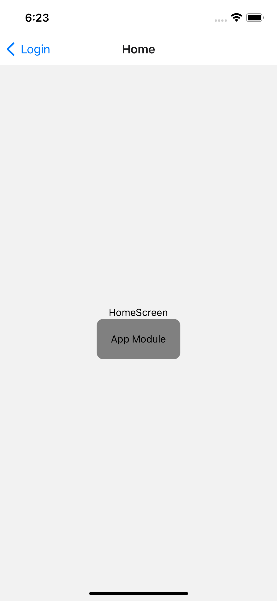
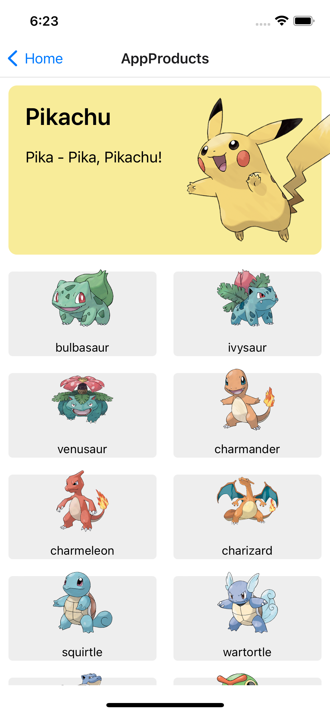

# multi-apps-examples

## Usage

Install dependencies & start module product server:

```bash
cd products && yarn install && yarn start --port 9000
```

Open new terminal. Install dependencies & start app host server:

```bash
cd host && yarn install && yarn start
```

Run android

```bash
cd host && yarn android
```

Run ios

```bash
cd host && npx pod-install && yarn ios
```

</br>
<p align="left">
  
  
</p>
